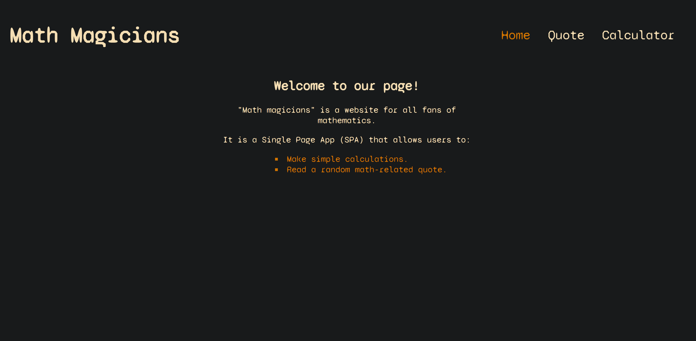
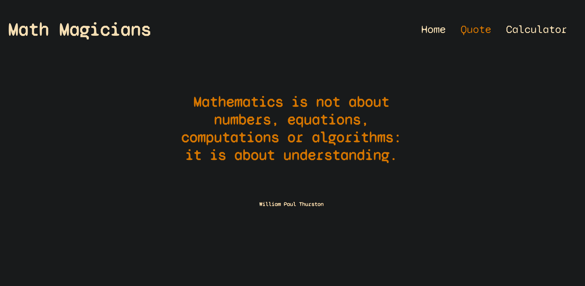
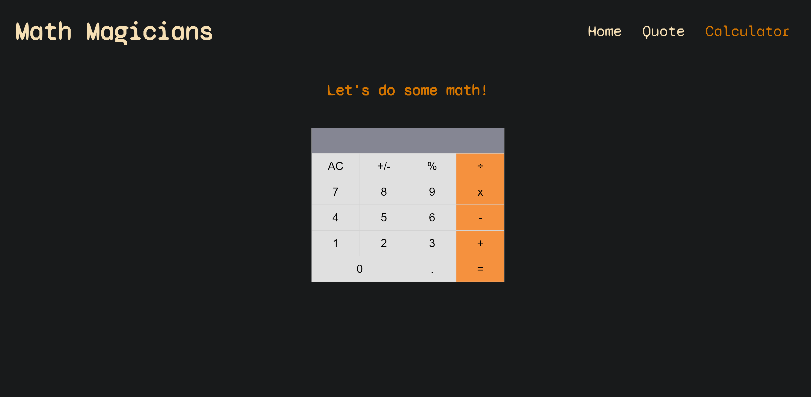

<a name="readme-top"></a>

<div align="center">

  <h3><b>Math Magicians</b></h3>

</div>

# 📗 Table of Contents

- [📖 About the Project](#about-project)
  - [🛠 Built With](#built-with)
    - [Tech Stack](#tech-stack)
    - [Key Features](#key-features)
  - [🚀 Live Demo](#live-demo)
- [💻 Getting Started](#getting-started)
  - [Setup](#setup)
  - [Prerequisites](#prerequisites)
  - [Install](#install)
  - [Usage](#usage)
  - [Run tests](#run-tests)
  - [Deployment](#triangular_flag_on_post-deployment)
- [👥 Authors](#authors)
- [🔭 Future Features](#future-features)
- [🤝 Contributing](#contributing)
- [⭐️ Show your support](#support)
- [🙏 Acknowledgements](#acknowledgements)
- [📝 License](#license)

# 📖 Math Magician <a name="about-project"></a>

**Math Magicians** is a website for all fans of mathematics. It is a Single Page App (SPA) that allows users to:

- Make simple calculations.
- Read a random math-related quote.

<div align="center">

  
  
  
  </div>

## 🛠 Built With <a name="built-with"></a>

### Tech Stack <a name="tech-stack"></a>

<details>
  <summary>Client</summary>
  <ul>
    <li><a href="https://reactjs.org/">React.js</a></li>
  </ul>
</details>

### Key Features <a name="key-features"></a>

- Make simple calculations
- Read a random math-related quote

<p align="right">(<a href="#readme-top">back to top</a>)</p>

## 🚀 Live Demo <a name="live-demo"></a>

[Live Demo Link](https://billy-math-magicians.onrender.com/)

<p align="right">(<a href="#readme-top">back to top</a>)</p>

## 💻 Getting Started <a name="getting-started"></a>

To get a local copy up and running, follow these steps:

### Prerequisites

In order to run this project you need:

- Code Editor: VS Code
- Web Browser
- Node
- Git

### Setup

- Clone the repository
- Change directory into the project folder

Example commands:

```sh
  git clone git@github.com:billymohajeri/Math-Magicians-Setup-3.git
```

### Install

Install this project with:

Example command:

`npm install`

### Usage

To run the project, execute the following command:

`npm start`

### Run tests

To run tests, run the following command:

Example command:

`npm test`

 <p align="right">(<a href="#readme-top">back to top</a>)</p>

## 👥 Authors <a name="authors"></a>

👤 **Billy Mohajeri**

- GitHub: [@BillyMohajeri](https://github.com/billymohajeri)
- Twitter: [@BillyMohajeri](https://twitter.com/BillyMohajeri)
- LinkedIn: [@BillyMohajeri](https://www.linkedin.com/in/billymohajeri)

<p align="right">(<a href="#readme-top">back to top</a>)</p>

<!-- FUTURE FEATURES -->

## 🔭 Future Features <a name="future-features"></a>

- Add some tests

<p align="right">(<a href="#readme-top">back to top</a>)</p>

<!-- CONTRIBUTING -->

## 🤝 Contributing <a name="contributing"></a>

Contributions, issues, and feature requests are welcome!

Feel free to check the [issues page](../../issues/).

<p align="right">(<a href="#readme-top">back to top</a>)</p>

<!-- SUPPORT -->

## ⭐️ Show your support <a name="support"></a>

If you like this project, you can support me by giving a ⭐.

<p align="right">(<a href="#readme-top">back to top</a>)</p>

<!-- ACKNOWLEDGEMENTS -->

## 🙏 Acknowledgments <a name="acknowledgements"></a>

<!-- > Give credit to everyone who inspired your codebase. -->

I would like to thank all of my code reviewers for giving me constructive feedback.

<p align="right">(<a href="#readme-top">back to top</a>)</p>

<!-- LICENSE -->

## 📝 License <a name="license"></a>

This project is [MIT](./LICENSE/MIT.md) licensed.

<p align="right">(<a href="#readme-top">back to top</a>)</p>
